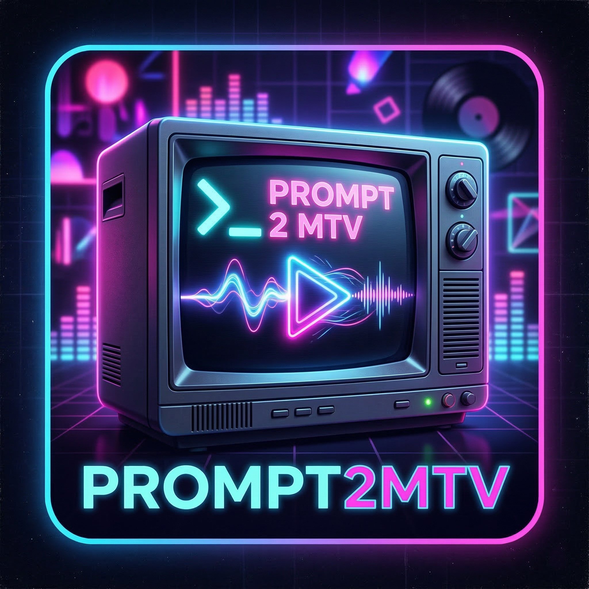

## 🎬 Demo Video

<p align="center">
	<a href="https://youtu.be/i6K0E86aFZw" target="_blank">
		
	</a>
</p>

**Watch a full music video generated in about 8 hours on an RTX 5060 Ti, using Autonomous mode with a single click.**

---

# Prompt2MTV

**Local AI Music Video Studio** — Generate video scenes, compose music, and merge them into finished music videos, all from one desktop app powered by ComfyUI.

## What It Does

- **AI Video** — Generate scenes with LTX 2.3 (text-to-video and image-to-video)
- **AI Music** — Compose original tracks with ACE-Step 1.5-XL (Turbo or SFT variants)
- **AI Chatbot** — Plan and refine scene prompts, brainstorm song concepts, and generate structured lyrics with a local Qwen 3 or Gemma 4 assistant
- **Autonomous Mode** — One-click pipeline that takes a creative brief and automatically generates all scenes, composes music, and merges the final video
- **Agentic Quality Control** — Selective thinking mode, per-scene confidence scoring with auto-retry, and batch continuity review with targeted regeneration
- **One-click merge** — Stitch clips, sync audio, and export final music videos
- **Project management** — Batch prompt queue, media gallery, drag-and-drop import, per-project settings

## Screenshots

### Chatbot Phase — AI Creative Assistant

| | |
|---|---|
| 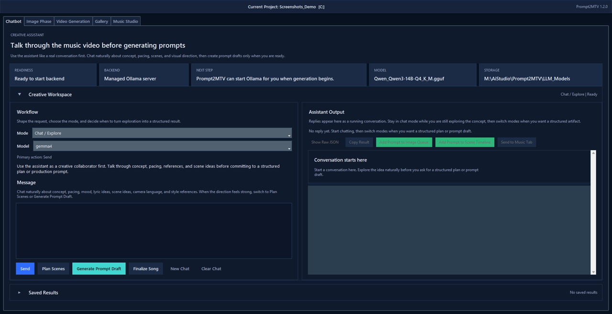 | 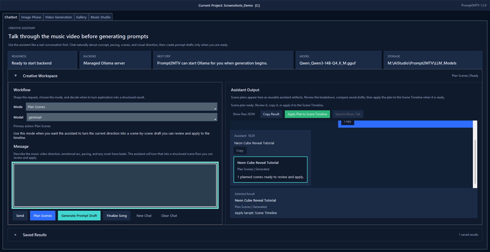 |
| **Model Readiness** — Setup and backend connectivity check | **Scene Planning** — AI brainstorms scene prompts from your brief |

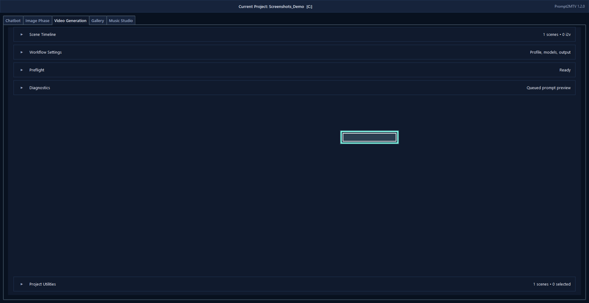
**Apply to Timeline** — One click moves the AI plan into the Scene Timeline

### Image Phase — AI Image Generation

| | |
|---|---|
| 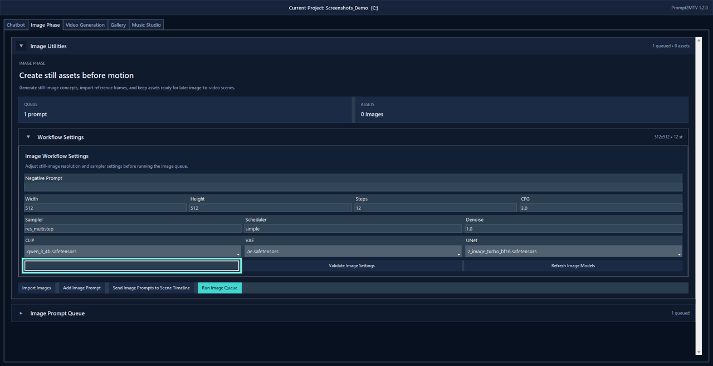 | 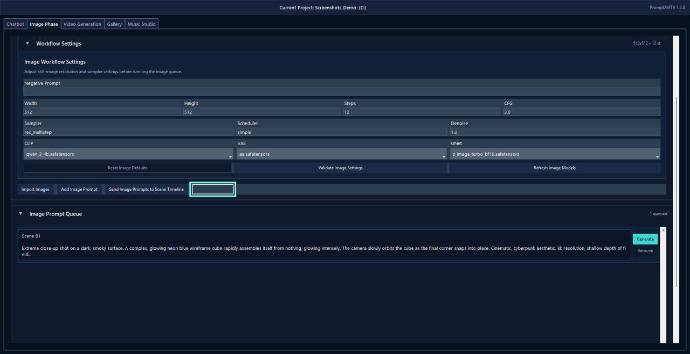 |
| **Workflow Settings** — Resolution, steps, CFG, and model selection | **Generated Output** — Real image from the batch prompt queue |

### Video Phase — Scene Render Pipeline

| | |
|---|---|
| 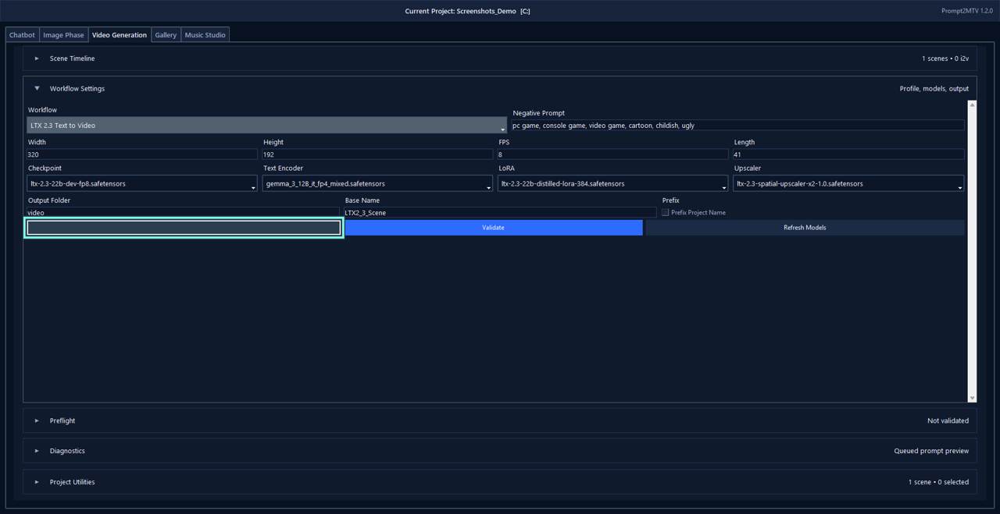 | 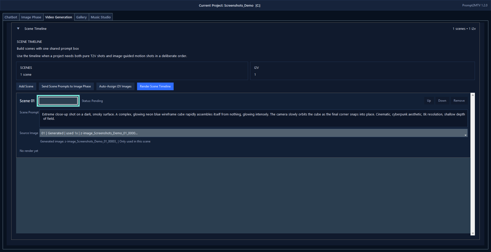 |
| **Video Settings** — Resolution, frame count, FPS, and models | **Image-to-Video** — Link a generated image as the scene source |

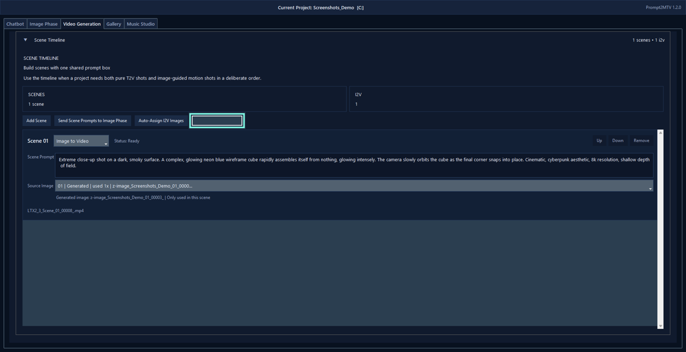
**Rendered Scene** — Real video output from the ComfyUI render pipeline

### Gallery Phase — Media Review & Stitching

| | |
|---|---|
| 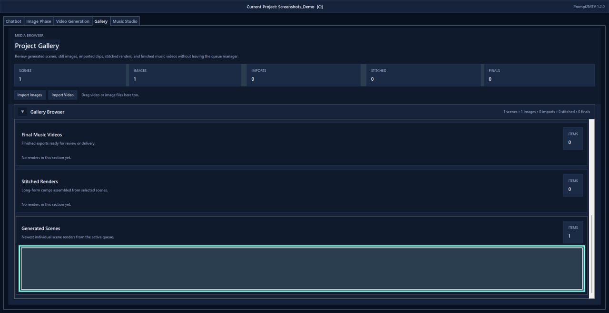 |  |
| **Gallery Browser** — Thumbnails for every generated clip and image | **Stitch Videos** — Select and combine clips into a single timeline |

### Music Phase — AI Soundtrack & Final Merge

| | |
|---|---|
| 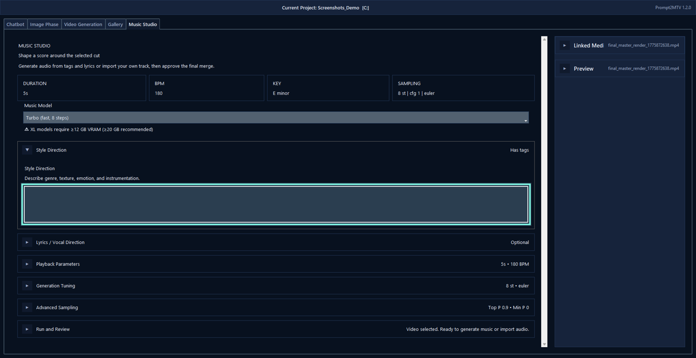 | 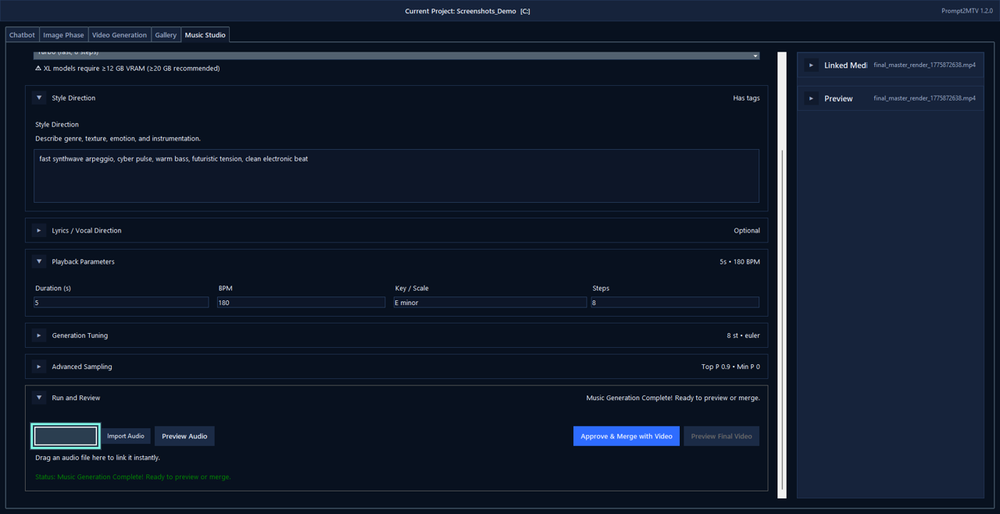 |
| **Music Tags** — Genre, mood, and instrumentation for ACE-Step | **Generated Track** — AI-composed soundtrack ready for merge |

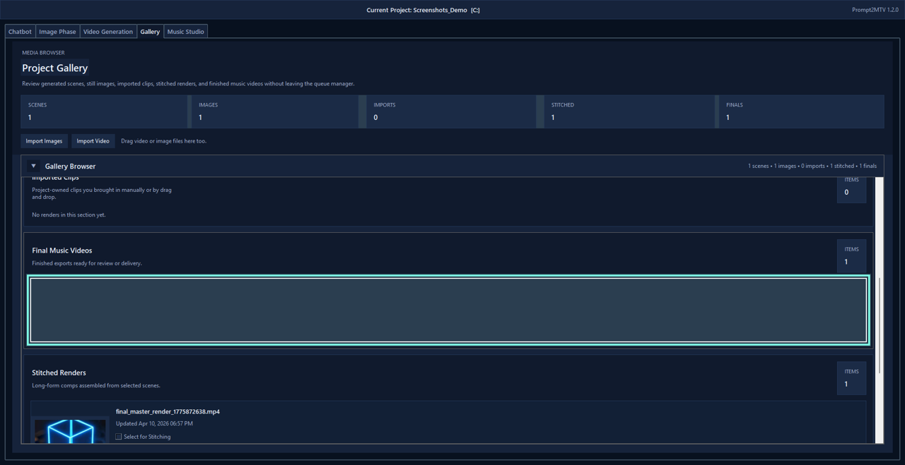
**Final Music Video** — Merged video + AI soundtrack in the Gallery

## Quick Start

### 1. Install ComfyUI

Download the portable build for your GPU and extract it (e.g. to `D:\ComfyUI`):

- [NVIDIA portable](https://github.com/comfyanonymous/ComfyUI/releases/latest/download/ComfyUI_windows_portable_nvidia.7z)
- [AMD portable](https://github.com/comfyanonymous/ComfyUI/releases/latest/download/ComfyUI_windows_portable_amd.7z)

Start ComfyUI once to confirm it works, then close it.

### 2. Install Prompt2MTV

Download the latest installer from [GitHub Releases](https://github.com/RorriMaesu/Prompt2MTV/releases) and run it. Everything the app needs is included — no Python or pip required.

### 3. Launch

Open Prompt2MTV from the desktop shortcut or Start Menu. On first launch it will:

- Locate your ComfyUI installation
- Detect any missing models and offer to download them automatically

The built-in AI chatbot supports two model families — **Qwen 3** and **Gemma 4** — switchable from the chatbot panel. Qwen 3 supports managed, Ollama, and remote server backends. Gemma 4 runs through Ollama.

If ComfyUI is in a non-default location, use **Project → Configure Runtime Paths**.

## Workflow

1. Create or open a project
2. *(Optional)* Use the AI chatbot to brainstorm and structure scene prompts or song lyrics
3. **Autonomous mode** — Enter a creative brief, set the target duration, and click Start. The app handles everything from scene generation through final merge.
4. **Or go manual** — Add prompts to the batch queue, generate scenes, review in the gallery, stitch clips, generate music, and merge manually.

### Autonomous Mode

Autonomous mode lives in the Chatbot tab under the collapsible **Autonomous Mode** section. Write a short creative brief describing the music video you want, set the target duration in seconds, choose an **AI Quality** preset, and click **Start**. The app will:

1. Expand your brief into a full creative concept (visual style, color palette, motifs, narrative arc)
2. Generate image and video prompts for each scene — enriched with concept context, song lyrics, and continuity from previous scenes
3. Self-assess each prompt with a confidence score and auto-retry weak results
4. *(Quality preset)* Run a batch continuity review across all prompts and regenerate up to 3 weak scenes
5. Generate images and videos through ComfyUI
6. Stitch clips together
7. Compose a matching soundtrack with ACE-Step
8. Merge audio and video into the final music video

#### AI Quality Presets

| Preset | Thinking | Confidence Check | Batch Review |
|--------|----------|-------------------|--------------|
| **Fast** | Off | Off | Off |
| **Balanced** | Planning tasks only | ≥ 6 (auto-retry once) | Off |
| **Quality** | Planning tasks only | ≥ 7 (auto-retry once) | Full review + targeted regen |

- **Thinking mode** uses Gemma 4's native thinking capability on concept expansion, scene outlining, and song brainstorming — giving the model time to reason before committing to an answer.
- **Confidence scoring** asks the model to rate each generated prompt (1–10). Prompts below the threshold are automatically regenerated once.
- **Batch review** examines all prompts together for visual coherence, narrative flow, and style consistency, then regenerates the weakest scenes.

A readiness indicator shows when ComfyUI is online. If you click Start before it's ready, the status label flashes to let you know. Once ComfyUI history is available, an ETA countdown appears during startup based on previous launch times.

#### VRAM Management

The autonomous pipeline is strictly sequential — the LLM is fully unloaded from VRAM before ComfyUI starts generating, and ComfyUI memory is freed between image and video phases. This means a 16 GB GPU can run the full pipeline without running out of memory. On first launch the app logs Ollama tuning tips (Flash Attention, KV cache quantization) if applicable.

## Required Models (~62 GB)

Prompt2MTV detects missing models on startup and can download them for you. Here's what the workflows need:

| Group | Model | Size |
|-------|-------|------|
| Video | `ltx-2.3-22b-dev-fp8.safetensors` | 29.1 GB |
| Video | `gemma_3_12B_it_fp4_mixed.safetensors` | 9.4 GB |
| Video | `ltx-2.3-22b-distilled-lora-384.safetensors` | 7.6 GB |
| Video | `ltx-2.3-spatial-upscaler-x2-1.0.safetensors` | 1.0 GB |
| Music | `acestep_v1.5_xl_turbo_bf16.safetensors` | 10.0 GB |
| Music | `acestep_v1.5_xl_sft_bf16.safetensors` | 10.0 GB |
| Music | `qwen_1.7b_ace15.safetensors` | 3.7 GB |
| Music | `qwen_0.6b_ace15.safetensors` | 1.2 GB |
| Music | `ace_1.5_vae.safetensors` | 0.3 GB |

The XL music models are selectable via the **Music Model** dropdown on the Music tab. You only need to download the variant(s) you plan to use — XL Turbo (fast, 8 steps) or XL SFT (best quality, 50 steps). The installer will let you choose which to download.

See `model_manifest.json` for download URLs and checksums.

### Chatbot Models (optional)

The AI chatbot uses one of these, depending on which family you select:

| Family | Model | Size | Backend |
|--------|-------|------|---------|
| Qwen 3 | `Qwen_Qwen3-14B-Q4_K_M.gguf` | ~9 GB | Managed, Ollama, or remote server |
| Gemma 4 | `gemma4:e4b` (default) | ~3 GB | Ollama only |

Gemma 4 also offers `e2b`, `26b`, and `31b` size variants in the app. Both models are downloaded automatically when first needed.

## Troubleshooting

- **App can't find ComfyUI** — Use **Project → Configure Runtime Paths** to set the path manually.
- **Port 8188 already in use** — A previous ComfyUI process may still be running. Kill it in Task Manager, then relaunch.
- **CUDA out-of-memory** — Don't generate video and music at the same time. Let one finish before starting the other.
- **Queue stuck at 0%** — ComfyUI may have crashed silently. Check the ComfyUI terminal (toggle it from the Video tab toolbar) and restart if needed.

## Support

If Prompt2MTV made your workflow easier, consider supporting development:

[](https://buymeacoffee.com/rorrimaesu)

---

## Developer Guide

Everything below is for contributors and anyone building from source.

### Setup

```powershell
git clone https://github.com/RorriMaesu/Prompt2MTV.git
cd Prompt2MTV
python -m venv .venv
.\.venv\Scripts\Activate.ps1
pip install -r requirements.txt
python ltx_queue_manager.py
```

### Build

```powershell
.\build_exe.bat              # → dist\Prompt2MTV\Prompt2MTV.exe
.\.build_installer.bat        # → dist_installer\Prompt2MTV-Setup-2.0.0.exe
```

### Upgrade helper

```powershell
.\tools\Install-Prompt2MTVRelease.ps1
```

Closes any running instance, uninstalls the previous version, reinstalls from the latest installer in `dist_installer`, and recreates the desktop shortcut.

### Repository layout

| File | Purpose |
|------|---------|
| `ltx_queue_manager.py` | Main app entry point and UI |
| `model_downloader.py` | Streamed model downloads with resume and SHA-256 verification |
| `model_manifest.json` | Required-model manifest for auditing and auto-download |
| `video_ltx2_3_t2v.json` | LTX 2.3 text-to-video ComfyUI workflow |
| `ACE_Step_AI_Music_Generator_Workflow.json` | ACE-Step music generation workflow |
| `Prompt2MTV.spec` | PyInstaller build config |
| `Prompt2MTV.iss` | Inno Setup installer config |
| `build_exe.bat` / `build_installer.bat` | Build scripts |

### Known architecture notes

- **Node ID fragility** — Workflows use hardcoded node IDs. Editing them in the ComfyUI graph editor may renumber IDs and break the payload mapper.
- **Process management** — ComfyUI runs as a subprocess. Force-killing the app can leave zombie processes holding port 8188.
- **VRAM contention** — Video and music generation share one ComfyUI instance. Running both concurrently will OOM. The queue enforces single-job execution.
- **XL music models** — ACE-Step 1.5-XL models require ≥12 GB VRAM (≥20 GB recommended). A warning label is shown in the Music tab.
- **Variable framerate** — ComfyUI outputs can drift to VFR. The stitcher normalizes with `-vsync 1 -r 24` to maintain audio sync.
