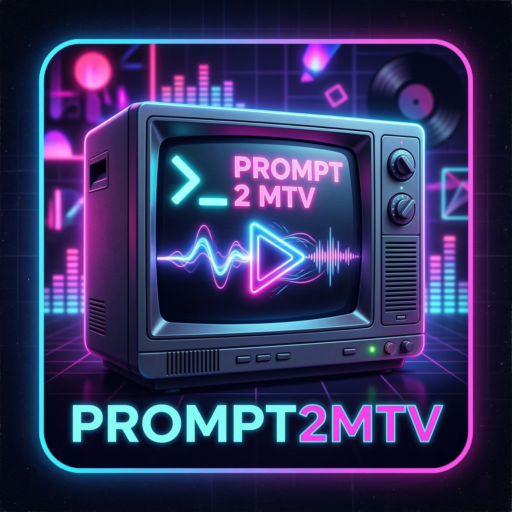

## 🎬 Demo Videos

<p align="center">
	<a href="https://youtu.be/i6K0E86aFZw" target="_blank">
		
	</a>
</p>

**Watch a full music video generated in about 8 hours on an RTX 5060 Ti, using Autonomous mode with a single click.** *(made with v2.0)*

<p align="center">
	<a href="https://www.youtube.com/watch?v=b0FMM0dyxqE" target="_blank">
		
	</a>
</p>

**Another full music video generated with Prompt2MTV.** *(made with v3.3)*

---

# Prompt2MTV

[](https://github.com/RorriMaesu/Prompt2MTV/releases/tag/v4.0.0)
[](https://github.com/RorriMaesu/Prompt2MTV/releases/latest)

**Local AI Video & Music Studio** — Generate video scenes, clone voices, synthesize narration, compose music, and merge them into finished YouTube videos or music videos, all from one desktop app powered by local models and ComfyUI.

---

### 📥 Quick Windows Download
Get the standalone Windows installer directly here:
👉 **[Download Prompt2MTV-Setup-4.0.0.exe](https://github.com/RorriMaesu/Prompt2MTV/releases/download/v4.0.0/Prompt2MTV-Setup-4.0.0.exe)**

*No complex developer setup or Python installation required! Just download and run.* See the [Full Quick Start Guide](#-quick-download--installation-windows) below.

---

## What It Does

- **AI Video** — Generate scenes with LTX 2.3 (text-to-video and image-to-video)
- **AI Narration & Voice Cloning** — Sample, clone, and synthesize narration using VibeVoice with custom voices or your own cloned voice
- **AI Music** — Compose original tracks with ACE-Step 1.5-XL (Turbo or SFT variants)
- **AI Chatbot** — Plan and refine scene prompts, brainstorm script/song concepts, and generate structured scripts or lyrics with a local Qwen 3 or Gemma 4 assistant
- **Autonomous Mode** — One-click pipeline that takes a creative brief and automatically generates all scenes, narrations, backing tracks, and merge them (supports both **YouTube Video** and **Music Video** project modes)
- **Agentic Quality Control** — Selective thinking mode, per-scene confidence scoring with auto-retry, and batch continuity review with targeted regeneration
- **One-click merge** — Stitch clips **with custom transition effects**, sync audio, and export final videos
- **Timeline Editor NLE** — Drag-and-drop non-linear editor: reorder clips, **trim video lengths**, preview video with transport controls, overlay narration and backing audio, zoom in/out, and export directly from the editor
- **Project management** — Batch prompt queue, media gallery, drag-and-drop import, per-project settings

## Screenshots

### Chatbot Phase — AI Creative Assistant

| | |
|---|---|
| 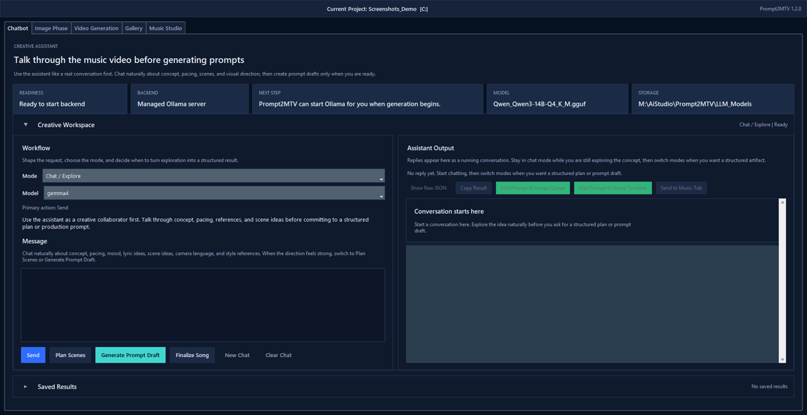 | 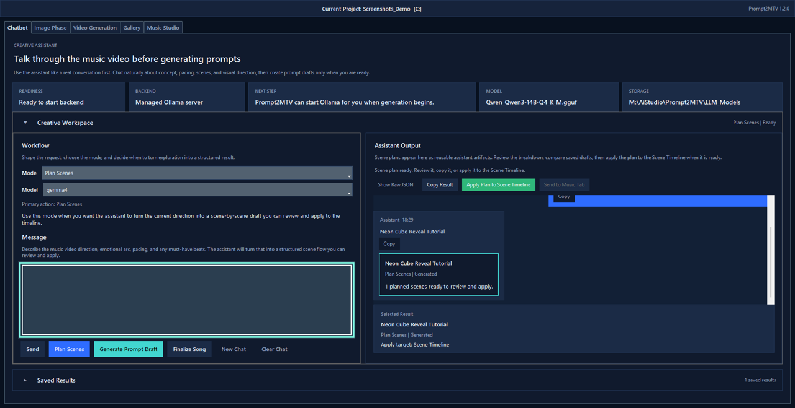 |
| **Model Readiness** — Setup and backend connectivity check | **Scene Planning** — AI brainstorms scene prompts from your brief |

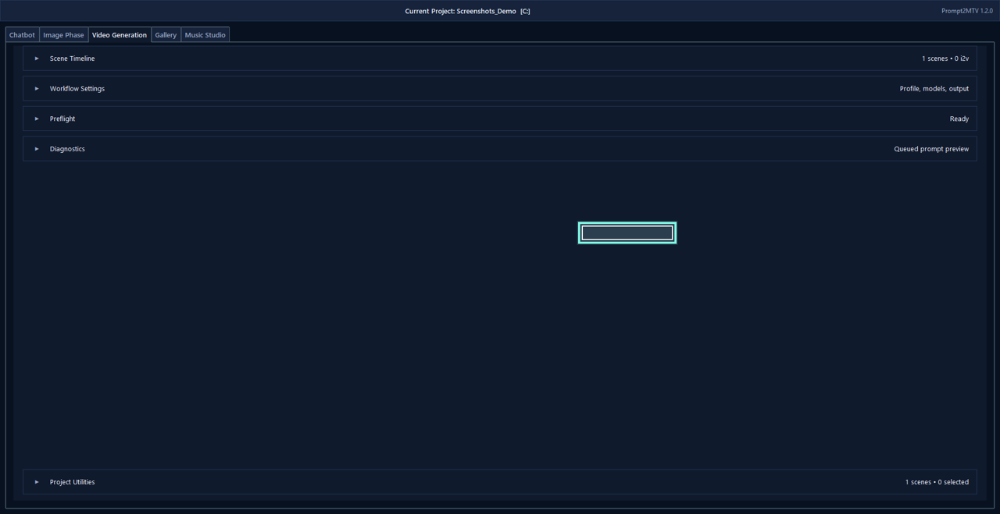
**Apply to Timeline** — One click moves the AI plan into the Scene Timeline

### Image Phase — AI Image Generation

| | |
|---|---|
| 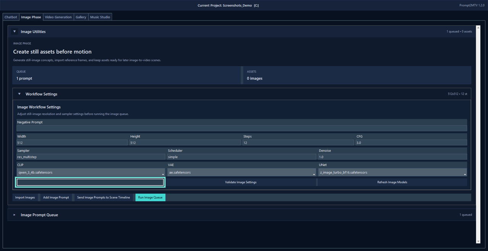 | 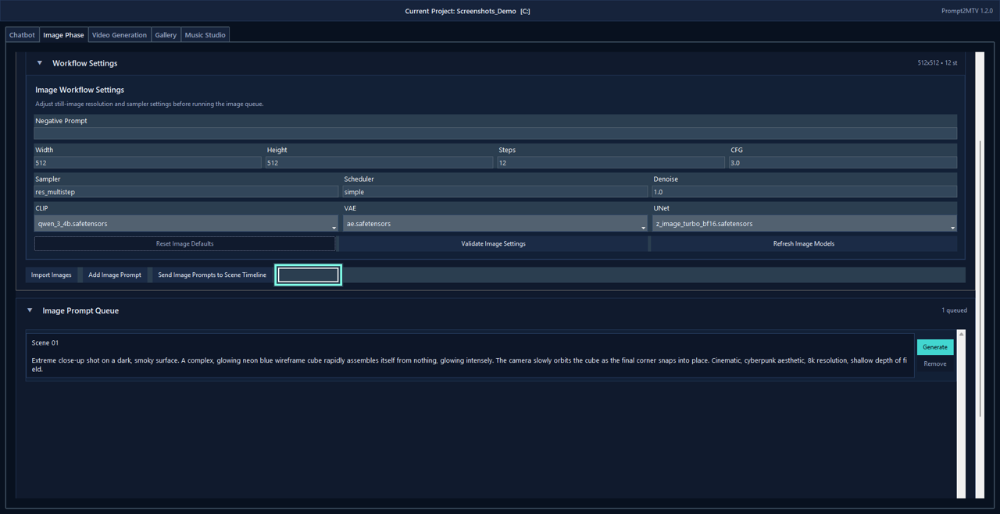 |
| **Workflow Settings** — Resolution, steps, CFG, and model selection | **Generated Output** — Real image from the batch prompt queue |

### Video Phase — Scene Render Pipeline

| | |
|---|---|
| 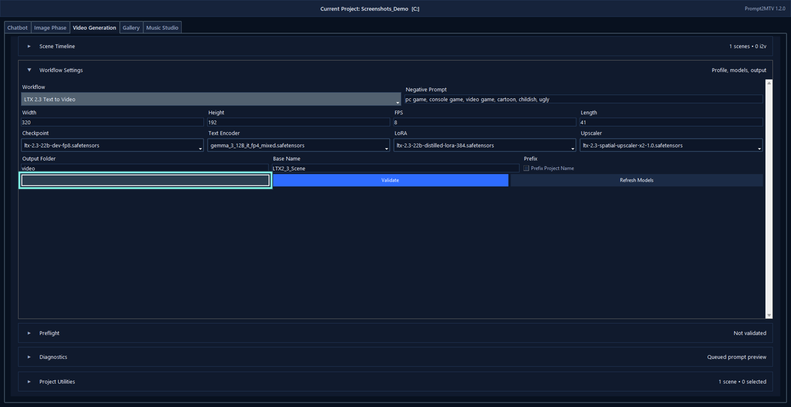 | 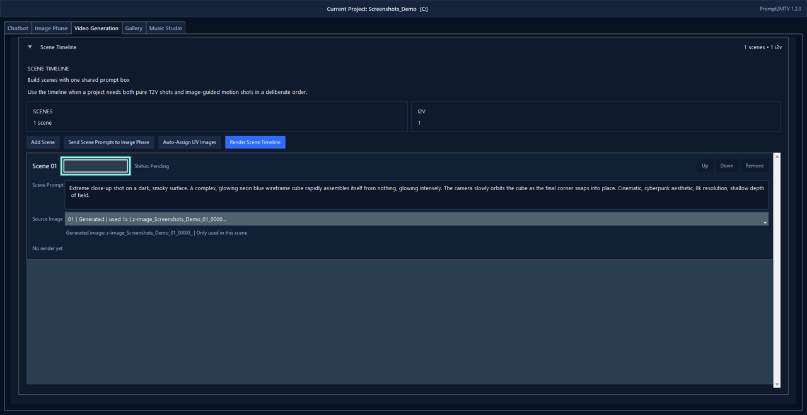 |
| **Video Settings** — Resolution, frame count, FPS, and models | **Image-to-Video** — Link a generated image as the scene source |

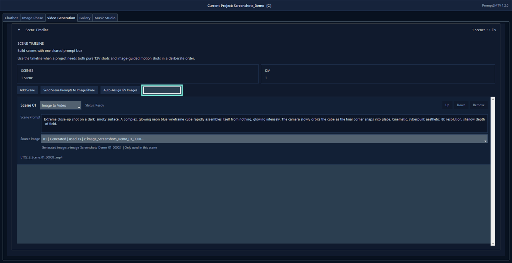
**Rendered Scene** — Real video output from the ComfyUI render pipeline

### Gallery Phase — Media Review & Stitching

| | |
|---|---|
| 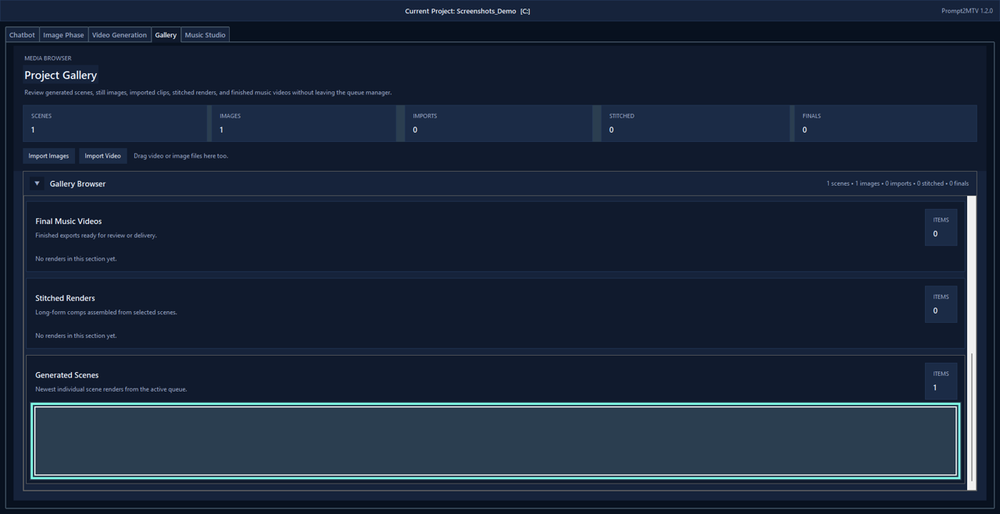 |  |
| **Gallery Browser** — Thumbnails for every generated clip and image | **Stitch Videos** — Select and combine clips into a single timeline |

### Music Phase — AI Soundtrack & Final Merge

| | |
|---|---|
| 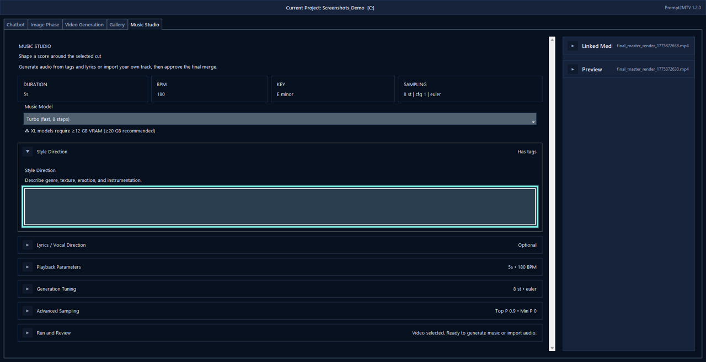 | 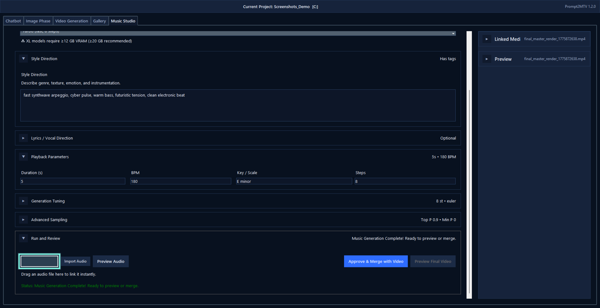 |
| **Music Tags** — Genre, mood, and instrumentation for ACE-Step | **Generated Track** — AI-composed soundtrack ready for merge |

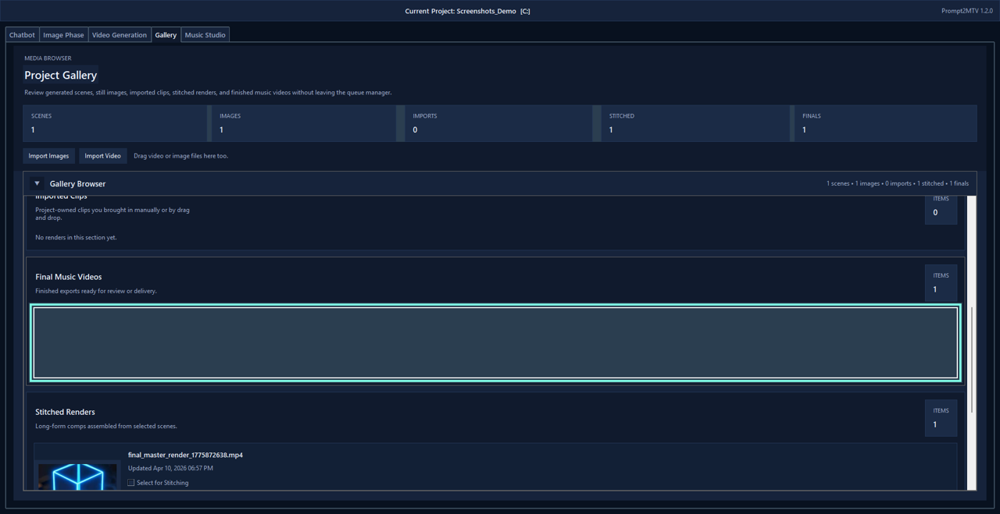
**Final Music Video** — Merged video + AI soundtrack in the Gallery

## 🚀 Quick Download & Installation (Windows)

For most users, you do **not** need to deal with code, terminal commands, or Python. Just follow these simple steps:

### 1. Download & Run the Installer
1. Click the button below to download the latest Windows installer:
   
   [**Download Prompt2MTV Installer (v4.0.0)**](https://github.com/RorriMaesu/Prompt2MTV/releases/download/v4.0.0/Prompt2MTV-Setup-4.0.0.exe)
   
   *(You can also access it on our [Latest Releases Page](https://github.com/RorriMaesu/Prompt2MTV/releases/latest) by downloading the file named `Prompt2MTV-Setup-4.0.0.exe`)*
2. Double-click the downloaded `Prompt2MTV-Setup-4.0.0.exe` file.
3. If a Windows SmartScreen warning pops up (common for newly released software), click **"More Info"** and then click **"Run Anyway"**.
4. Follow the installer instructions to finish setting up the app. It will create a handy desktop shortcut!

### 2. Download ComfyUI (Needed for AI Video & Music)
Prompt2MTV uses a tool called **ComfyUI** behind the scenes to run the local AI models. If you don't already have it:
1. Download the pre-packaged version for your computer's graphics card:
   - [📥 NVIDIA Graphics Cards (Recommended)](https://github.com/comfyanonymous/ComfyUI/releases/latest/download/ComfyUI_windows_portable_nvidia.7z)
   - [📥 AMD Graphics Cards](https://github.com/comfyanonymous/ComfyUI/releases/latest/download/ComfyUI_windows_portable_amd.7z)
2. Extract the downloaded folder (using a program like 7-Zip or WinRAR) to a location on your computer (for example, `D:\ComfyUI` or `C:\ComfyUI`).
3. Run ComfyUI once (by clicking the file named `run_nvidia_gpu.bat` inside the folder) to confirm it launches in your web browser, then close the ComfyUI terminal window.

### 3. Launch Prompt2MTV
1. Open **Prompt2MTV** using the shortcut on your desktop or through the Windows Start Menu.
2. On first launch, the app will ask you to select the folder where you extracted ComfyUI.
3. The app will automatically check for any required AI models. You don't have to download them manually—the app will present a list and download them for you automatically!

*(Note: The built-in AI chatbot supports **Qwen 3** and **Gemma 4** model families. Qwen 3 works via local Ollama or a remote server, while Gemma 4 runs via local Ollama. If you need to change your ComfyUI path later, just go to **Project → Configure Runtime Paths** in the top menu.)*

## Workflow

1. Create or open a project
2. Select your **Project Mode** in the settings tab: **YouTube Video Creator** (for narrated content) or **Music Video Studio (MTV)** (for music-centric videos).
3. *(Optional)* Use the AI chatbot to brainstorm script ideas, scene outlines, visual pacing, or song lyrics.
4. **Autonomous Mode** — Enter a creative brief, set target duration, and click Start. The pipeline handles all generation and compilation.
5. **Or Go Manual** — Queue custom prompts, generate video clips, record narration, compose backing tracks, and arrange them on the Timeline Editor.

### Autonomous Workflows

Autonomous mode lives in the Chatbot tab under the collapsible **Autonomous Mode** section. Write a creative brief, set the target duration in seconds, choose an **AI Quality** preset, and click **Start**.

#### 📺 YouTube Video Automation (Step-by-Step)
If your project is set to **YouTube Video Creator** mode, the pipeline executes the following steps:
1. **Expand Concept** — Enriches your brief into a full visual direction (narrative arc, tone, styling cues).
2. **Write Script** — The chatbot writes a paragraph-by-paragraph voiceover script tailored to fit your target duration.
3. **Brainstorm Scenes** — Brainstorms visual prompts (composition, lighting, motion descriptors) matching each script segment.
4. **Generate Voiceovers** — Synthesizes narrator speech using the selected or cloned voice.
5. **Generate Video Scenes** — Renders all visual assets sequentially via ComfyUI (LTX 2.3).
6. **Stitch Video** — Stitches all rendered scenes into a continuous video.
7. **Compose backing music** — Generates a subtle background instrumental track using ACE-Step.
8. **Final Mix & Merge** — Blends the voiceover narration, background music (ducked automatically to not overpower the voice), and the video scenes.

#### 🎵 Music Video (MTV) Automation (Step-by-Step)
If your project is set to **Music Video Studio (MTV)** mode, the pipeline executes the following steps:
1. **Expand Concept** — Refines the video concept and themes.
2. **Write Lyrics** — Brainstorms song structure, genres, and lyrics matching your brief.
3. **Outlines Scenes** — Creates storyboard scene descriptions based on the lyric segments.
4. **Generate Video Scenes** — Renders still images and LTX 2.3 motion clips via ComfyUI.
5. **Stitch Video** — Combines all rendered scenes.
6. **Compose Music** — Generates a full-volume, original vocal/instrumental track with ACE-Step.
7. **Final Merge** — Combines the stitched video and the soundtrack.

#### AI Quality Presets

| Preset | Thinking | Confidence Check | Batch Review |
|--------|----------|-------------------|--------------|
| **Fast** | Off | Off | Off |
| **Balanced** | Planning tasks only | ≥ 6 (auto-retry once) | Off |
| **Quality** | Planning tasks only | ≥ 7 (auto-retry once) | Full review + targeted regen |

- **Thinking mode** uses Gemma 4's native thinking capability on concept expansion, scene outlining, and song/script brainstorming.
- **Confidence scoring** asks the model to rate each generated prompt (1–10). Prompts below the threshold are automatically regenerated once.
- **Batch review** examines all prompts together for visual coherence and narrative consistency, then regenerates the weakest scenes.

### 🎙️ 15-Second Voice Cloning Setup (VibeVoice)

You can clone your own voice (or sample any voice) to use as the narrator for YouTube automation in about 15 seconds:

1. In the Project menu or the YouTube settings frame, click **Voice Cloning Setup Wizard**.
2. Select **Create New Profile...** and type a speaker name.
3. Select your recording microphone from the dropdown list.
4. Click **🔴 Start Recording** and read the short passage on the screen clearly:
   > *"Antigravity is a powerful AI coding assistant designed by Google DeepMind. We are pair programming to create amazing tools, generating videos, music, and voiceovers. This cloned voice sounds clear and natural, perfect for video production!"*
5. Click **Stop Recording** when finished. You can click **Play Sample** to listen to the recording.
6. Type a short test sentence and click **⚙️ Run Verification**. The local VibeVoice engine will synthesize your cloned voice speaking that sentence. Click **Listen to Cloned Test Voice** to verify.
7. Click **Save and Complete**. The profile is saved and automatically selected as your active narrator!

#### VRAM Management

The autonomous pipeline is strictly sequential — the LLM is fully unloaded from VRAM before ComfyUI starts generating, and ComfyUI memory is freed between image and video phases. This means a 16 GB GPU can run the full pipeline without running out of memory. On first launch the app logs Ollama tuning tips (Flash Attention, KV cache quantization) if applicable.

## Required Models (~62 GB)

Prompt2MTV detects missing models on startup and can download them for you. Here's what the workflows need:

| Group | Model | Size |
|-------|-------|------|
| Video | `ltx-2.3-22b-dev-fp8.safetensors` | 29.1 GB |
| Video | `gemma_3_12B_it_fp4_mixed.safetensors` | 9.4 GB |
| Video | `ltx-2.3-22b-distilled-lora-384.safetensors` | 7.6 GB |
| Video | `ltx-2.3-spatial-upscaler-x2-1.0.safetensors` | 1.0 GB |
| Music | `acestep_v1.5_xl_turbo_bf16.safetensors` | 10.0 GB |
| Music | `acestep_v1.5_xl_sft_bf16.safetensors` | 10.0 GB |
| Music | `qwen_1.7b_ace15.safetensors` | 3.7 GB |
| Music | `qwen_0.6b_ace15.safetensors` | 1.2 GB |
| Music | `ace_1.5_vae.safetensors` | 0.3 GB |

The XL music models are selectable via the **Music Model** dropdown on the Music tab. You only need to download the variant(s) you plan to use — XL Turbo (fast, 8 steps) or XL SFT (best quality, 50 steps). The installer will let you choose which to download.

See `model_manifest.json` for download URLs and checksums.

### Chatbot Models (optional)

The AI chatbot uses one of these, depending on which family you select:

| Family | Model | Size | Backend |
|--------|-------|------|---------|
| Qwen 3 | `Qwen_Qwen3-14B-Q4_K_M.gguf` | ~9 GB | Managed, Ollama, or remote server |
| Gemma 4 | `gemma4:e4b` (default) | ~3 GB | Ollama only |

Gemma 4 also offers `e2b`, `26b`, and `31b` size variants in the app. Both models are downloaded automatically when first needed.

## Troubleshooting

- **App can't find ComfyUI** — Use **Project → Configure Runtime Paths** to set the path manually.
- **Port 8188 already in use** — A previous ComfyUI process may still be running. Kill it in Task Manager, then relaunch.
- **CUDA out-of-memory** — Don't generate video and music at the same time. Let one finish before starting the other.
- **Queue stuck at 0%** — ComfyUI may have crashed silently. Check the ComfyUI terminal (toggle it from the Video tab toolbar) and restart if needed.

## Support

If Prompt2MTV made your workflow easier, consider supporting development:

[](https://buymeacoffee.com/rorrimaesu)

---

## Developer Guide

Everything below is for contributors and anyone building from source.

### Setup

```powershell
git clone https://github.com/RorriMaesu/Prompt2MTV.git
cd Prompt2MTV
python -m venv .venv
.\.venv\Scripts\Activate.ps1
pip install -r requirements.txt
python ltx_queue_manager.py
```

### Build

**Prerequisites**

| Tool | Required for | Download |
|------|-------------|----------|
| Python 3.11+ + venv | Both build targets | [python.org](https://www.python.org/downloads/) |
| [Inno Setup 6](https://jrsoftware.org/isdl.php) | Installer only (`build_installer.bat`) | [jrsoftware.org](https://jrsoftware.org/isdl.php) |

PyInstaller is installed automatically by the build script; you don't need to install it manually.

**Build the standalone EXE** (no installer, just the runnable folder):

```powershell
.\build_exe.bat
# Output: dist\Prompt2MTV\Prompt2MTV.exe
```

**Build the Windows installer** (runs `build_exe.bat` first, then packages with Inno Setup):

```powershell
.\build_installer.bat
# Output: dist_installer\Prompt2MTV-Setup-4.0.0.exe
```

Run the resulting `Prompt2MTV-Setup-4.0.0.exe` to install the app — it adds a desktop shortcut and Start Menu entry.

### Upgrade helper

```powershell
.\tools\Install-Prompt2MTVRelease.ps1
```

Closes any running instance, uninstalls the previous version, reinstalls from the latest installer in `dist_installer`, and recreates the desktop shortcut.

### Repository layout

| File | Purpose |
|------|---------|
| `ltx_queue_manager.py` | Main app entry point and UI |
| `model_downloader.py` | Streamed model downloads with resume and SHA-256 verification |
| `model_manifest.json` | Required-model manifest for auditing and auto-download |
| `video_ltx2_3_t2v.json` | LTX 2.3 text-to-video ComfyUI workflow |
| `ACE_Step_AI_Music_Generator_Workflow.json` | ACE-Step music generation workflow |
| `Prompt2MTV.spec` | PyInstaller build config |
| `Prompt2MTV.iss` | Inno Setup installer config |
| `build_exe.bat` / `build_installer.bat` | Build scripts |

### Known architecture notes

- **Node ID fragility** — Workflows use hardcoded node IDs. Editing them in the ComfyUI graph editor may renumber IDs and break the payload mapper.
- **Process management** — ComfyUI runs as a subprocess. Force-killing the app can leave zombie processes holding port 8188.
- **VRAM contention** — Video and music generation share one ComfyUI instance. Running both concurrently will OOM. The queue enforces single-job execution.
- **XL music models** — ACE-Step 1.5-XL models require ≥12 GB VRAM (≥20 GB recommended). A warning label is shown in the Music tab.
- **Variable framerate** — ComfyUI outputs can drift to VFR. The stitcher normalizes with `-vsync 1 -r 24` to maintain audio sync.
